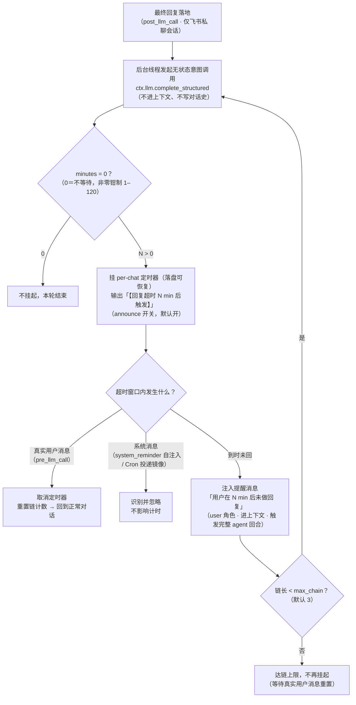

# reply-timeout (Hermes plugin)

Hermes Agent 插件：为飞书私聊会话提供「回复超时」机制。

## 解决什么问题

Hermes 的交互提问（clarify）只能活在一轮对话内；cron 是定时器不是等回信；heartbeat
是会话级且只能用户手动挂。插件补上「我留了一条需要你回复的消息，超时后我自己决定
下一步」这个缺口。

## 行为（P0：仅飞书私聊）

1. 每轮最终回复落地后（`post_llm_call`），后台线程发起**一次无状态**结构化意图调用
   （`ctx.llm.complete_structured`，不进会话上下文、不写 state.db 对话史）：输出整数
   分钟数——等用户回复的预计时长，0＝不等待，钳制在 `[min_minutes, max_minutes]`
   （默认 1–120）。
2. 分钟数 > 0 → 为该会话挂定时器（每会话唯一，新挂替换旧挂），并向会话输出
   「【回复超时 N min 后触发】」（可关）。
3. 超时窗口内该会话收到**真实用户消息**即取消定时器并重置链计数；插件自己注入的
   `<system_reminder>` 与 `[Cron delivery:` 镜像不算用户消息，不会误取消/误重置。
4. 到时未回 → 向会话注入一条 user 角色 `<system_reminder>用户在 N min 后未做回复
   </system_reminder>`（有状态：进上下文、写 state.db、触发完整一轮 agent 运行），
   由 Hermes 依据上下文自行决策。
5. 唤醒轮自身允许再挂超时，但链长 ≤ `max_chain`（默认 3）；真实用户消息重置计数。

群聊（`group_sessions_per_user`、话题）与 cron 投递适配为第二版范围。

## 行为流程图



## 任务清单

- [x] P0 实现（v0.1.0 · 2026-10-06）
  - [x] `post_llm_call` 挂起 + 无状态意图调用（`ctx.llm.complete_structured`）
  - [x] per-chat 定时器 + 横幅输出（`announce` 开关）
  - [x] 超时注入 `system_reminder`（`allow_gateway_injection: true`）
  - [x] 真实入站取消并重置链；系统消息过滤（reminder / Cron 镜像不误触发）
  - [x] 链上限（`max_chain`，默认 3）
  - [x] 网关重启恢复（未到期按剩余时间重挂、已到期丢弃）
  - [x] 专用意图模型配置（`intent_provider` / `intent_model`，未授权时回退会话模型）
  - [x] 离线单测 22 项全通过（FakeCtx / FakeLlm）
  - [x] 10-06 实测修复：`hermes send` 子进程级联（register 副作用限网关进程＋restore 永不 announce＋直连飞书 API 发横幅）与同进程双注册守卫（单测 28 项）
  - [x] 10-06 P0 阻断修复：计时器创建后漏 `start()` 致到点不触发；补「真实到点触发」防回归用例（单测 30 项）
- [ ] 线上验证（待网关重启后跑一轮真实私聊会话：横幅 → 超时注入 → 链条 → 重置）
- [ ] cron 适配（P1 / v0.2）
  - [ ] 显式 `arm` 工具：cron 提示词可调用「挂 N 分钟回复超时」
  - [ ] cron 投递回合的挂起与回复解除（晨间对齐 / 22:30 日报接入）
- [ ] 群聊适配（P2 / v0.3）
  - [ ] `group_sessions_per_user` 两种隔离模式的键位适配
  - [ ] 话题群（thread）会话键支持与投递落点验证
  - [ ] feishu-history 插件兼容性验证
- [ ] 礼貌守卫（非功能性 / P3）
  - [ ] 静默时段（active hours，窗外不挂或顺延）
  - [ ] 次数/频率上限（每日唤醒配额）

## 配置（`~/.hermes/config.yaml`）

```yaml
plugins:
  enabled:
    - reply-timeout
  entries:
    reply-timeout:
      allow_gateway_injection: true   # 必需：允许注入提醒消息触发网关回合
      settings:
        announce: true                # 是否输出「【回复超时 N min 后触发】」
        max_chain: 3                  # 唤醒链上限
        min_minutes: 1                # 钳制下限
        max_minutes: 120              # 钳制上限
        intent_provider: ""           # 专用意图模型 provider（空＝继承会话）
        intent_model: ""              # 专用意图模型名（空＝继承会话）
```

> 专用模型覆盖需要同时开 `llm.allow_model_override`（跨 provider 还需
> `llm.allow_provider_override`），否则回退到会话模型——见官方文档 Plugin LLM Access。

生效需重启网关（用户手动执行）。

## 设计要点

- 意图调用复用当轮上下文要点（用户消息＋最终回复，各截 1200 字）以贴近缓存前缀，
  但缓存命中不做承诺（前缀逐字节一致才能命中）。
- 计时器经 `ctx.state` 落盘：网关重启后未到期的按剩余时间重挂，已到期的丢弃。
- `state.db` 只以 `mode=ro` 打开（本机铁律，防 store-lockout）。
- 提醒注入走官方 `ctx.inject_message`（网关模式需 `allow_gateway_injection: true`）；
  横幅经 `hermes send` 子进程发送（插件无裸发消息 API，且不 import 适配器内部）。
- 钩子回调立即返回（30s 上限约束）：意图调用＋挂表全部在受监管后台线程完成。

## 验证

```bash
cd ~/.hermes/plugins/reply-timeout
python3 tests/test_offline.py   # 离线单测（不调 LLM、不真发消息）
```

## License

MIT
